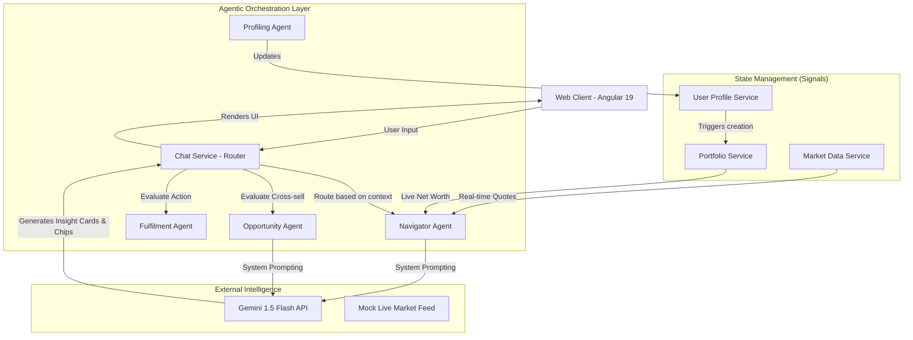

# ET Concierge — Architecture & Agent Orchestration

## High-Level System Architecture

ET Concierge uses a **multi-agent, frontend-driven architecture** built on Angular 19, powered by Google's **Gemini 1.5 Flash**. By leveraging Angular Signals for reactive state management and a suite of specialized TypeScript-based logical agents, the system achieves real-time, low-latency intelligence.

## Agent Roles & Responsibilities

The system replaces a single monolithic chatbot with a **routing engine** that activates specialized agents:

1. **Profiling Agent (The Onboarder)**
   - **Role**: Greets users, executes the 3-minute financial profile survey, and determines the initial "Discovery Score."
   - **Logic**: Uses deterministic logic to generate a realistic starting portfolio (e.g., ₹1.2Cr for wealth tier) instead of starting from zero.

2. **Navigator Agent (The Core Brain)**
   - **Role**: Answers broad financial queries, analyzes market trends, and contextualizes news against the user's specific portfolio.
   - **Integration**: Injects real-time SENSEX/NIFTY data and current user net worth directly into the Gemini API system prompt at runtime, preventing hallucination.

3. **Opportunity Agent (The Cross-Sell Engine)**
   - **Role**: Silently monitors the conversation for intent. If the user mentions "credit card," "loan," or "tax," it triggers a proactive cross-sell event.
   - **Integration**: Injects "XSell Cards" (e.g., HDFC Home Loan, Axis Ace Card) into the chat stream and updates the Discovery Score in the sidebar.

4. **Fulfilment Agent (The Closer)**
   - **Role**: Converts advice into action. When the user agrees to proceed, it generates actionable steps (e.g., "Schedule callback," "Download application").

## Error Handling & Fallback logic

- **API Failure**: If the Gemini API is unreachable or times out, the `ChatService` employs a **Local Fallback Engine**. This engine isn't static text; it still pulls live market data from the `MarketService` and portfolio logic, ensuring the app remains fully functional and "alive" even when offline.
- **Context Window Management**: The app maintains a rolling history of the last 12 messages to ensure context is maintained without exceeding token limits or driving up API costs.
