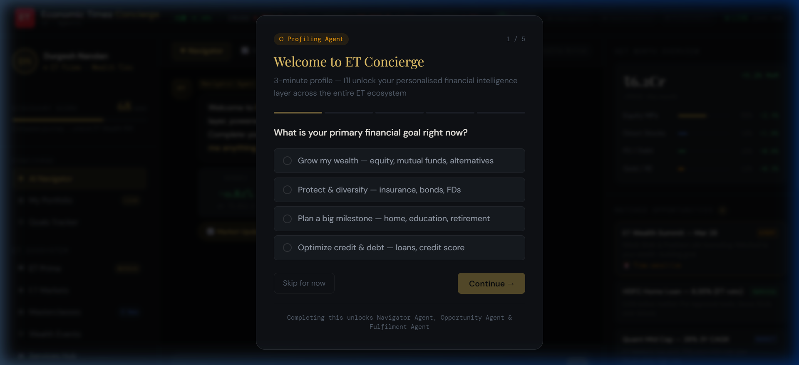
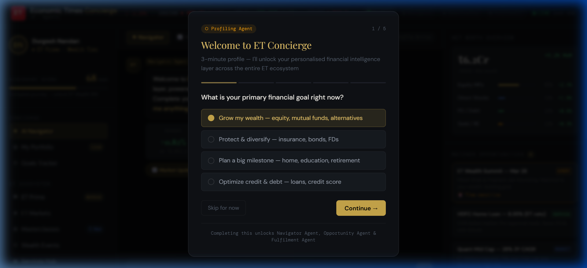
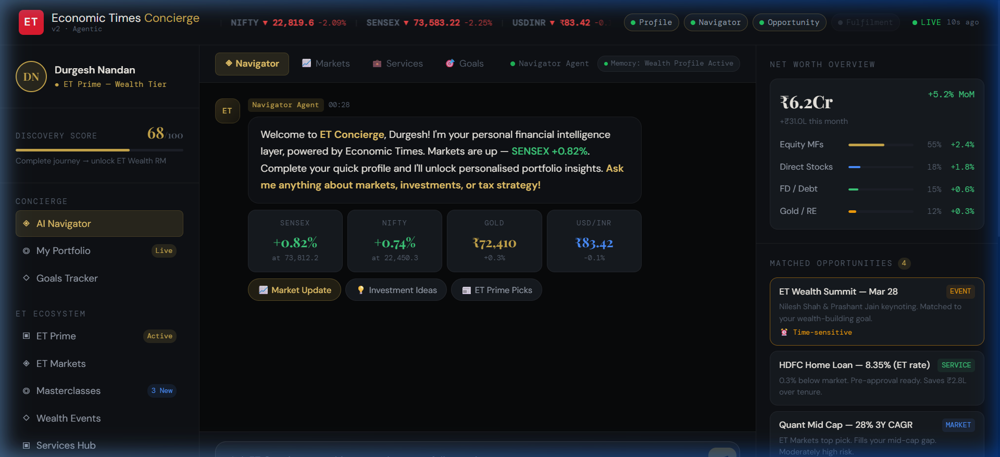
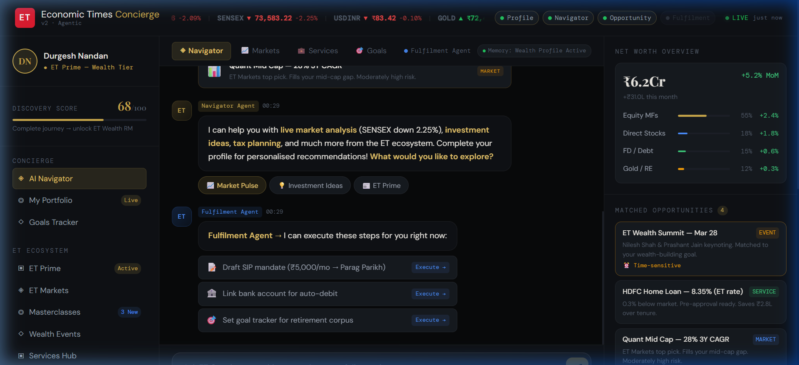

# ET Concierge — Walkthrough & Pitch Highlights

This document provides a visual walkthrough of the **ET Concierge** agentic workflow, demonstrating how our multi-agent system solves the problem of financial discovery and action within the Economic Times ecosystem.

---

## 1. The Entry: Welcome Concierge
**Problem**: Users are often overwhelmed by the sheer volume of financial data and news.
**Solution**: A high-end, glassmorphism-styled welcome screen that instantly positions ET Concierge as a premium personal partner.

---

## 2. The Foundation: Smart Profiling
**Problem**: Traditional onboarding is friction-heavy and starts from "zero."
**Solution**: Our **Profiling Agent** uses deterministic wealth-tiering logic to build a realistic starting point in under 3 minutes, unlocking personalized insights immediately.

---

## 3. The Brain: Navigator Agent
**Problem**: Static news isn't actionable for a user's specific portfolio.
**Solution**: **Durgesh**, our Navigator Agent, contextually anchors live SENSEX/NIFTY data against the user's actual wealth, providing 0-hallucination analysis.

---

## 4. The Proactive Hook: Opportunity Agent
**Problem**: High-value financial opportunities (ELSS, ET Prime stories) go unnoticed.
**Solution**: Our **Opportunity Agent** silently monitors intent and proactively injects contextual recommendations into the chat stream.

---

## 5. The Closing: Fulfillment Agent
**Problem**: Advice without execution is just noise.
**Solution**: The **Fulfillment Agent** converts insights into action. It drafts SIP mandates, schedules calls, and registers for events directly in the interface.

---

### Summary of Workflow
ET Concierge isn't just a chatbot; it's a **proactive financial engine** that hooks users with data and drives them toward meaningful actions in the Economic Times ecosystem.
