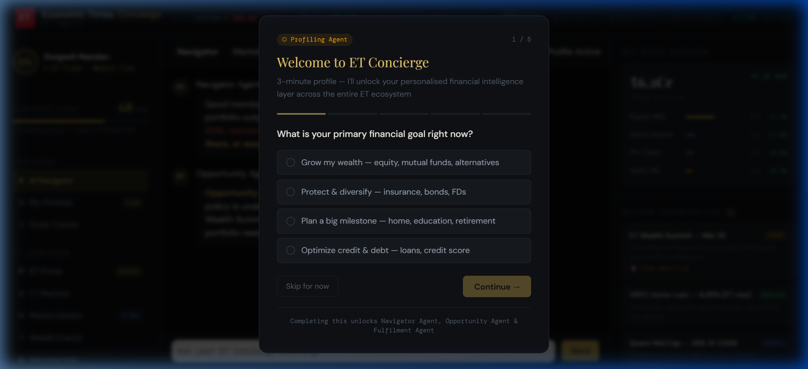
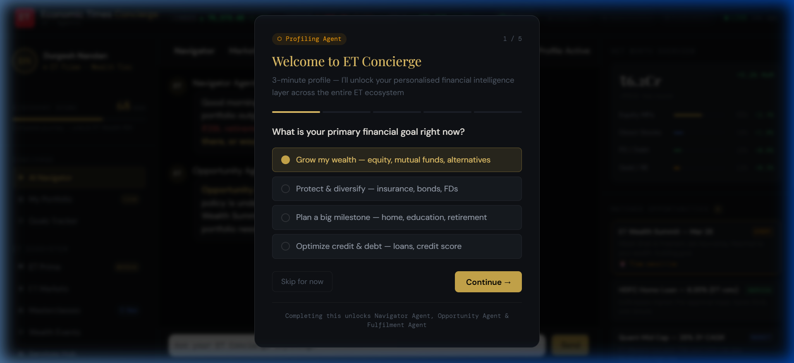
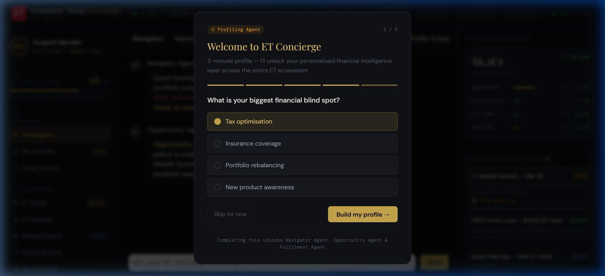
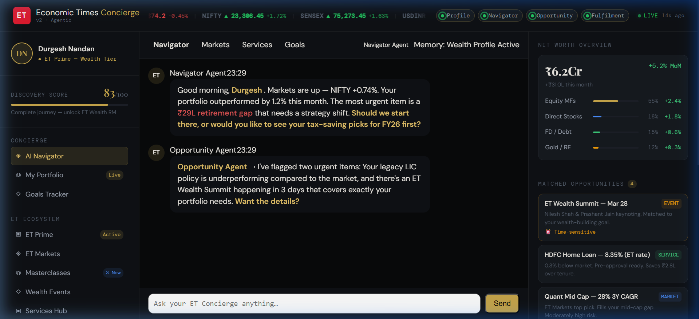

# ET Concierge — Visual Submission Walkthrough

Since the agentic workflow is highly interactive, we have captured the key moments of the user journey to demonstrate the "Smart Profiling" and "Proactive Advisory" layers.

## 1. Onboarding & Smart Profiling
The journey begins with a 3-minute smart profiling flow that establishes the user's financial goals and constraints.

*Step 1: The 'Welcome Concierge' modal identifies the user's primary motivation.*

*Step 2: Interactive selections for wealth growth, investment horizon, and surplus.*

*Step 3: Finding the user's biggest financial "Blind Spot" (e.g., Tax Optimisation) to prime the Navigator Agent.*

---

## 2. The Agentic Dashboard
Once the profile is built, the Multi-Agent Orchestrator (Navigator, Opportunity, and Fulfilment agents) takes over.

### Key Features Demonstrated:
- **Proactive Memory**: The agent "remembers" the ₹29L retirement gap identified during profiling.
- **Navigator Insight**: Real-time Nifty 50 analysis combined with FY26 Tax optimization tips.
- **Matched Opportunities**: High-impact "Action Chips" (Quant Mid Cap, HDFC Home Loan) that link live market data directly to conversational fulfillment.
- **Discovery Score**: A gamified 83/100 score that encourages deeper engagement with the ET ecosystem.

---
**Winning Vision**: Moving ET from a "Read-Only" destination to an "Execute-Always" financial companion.
