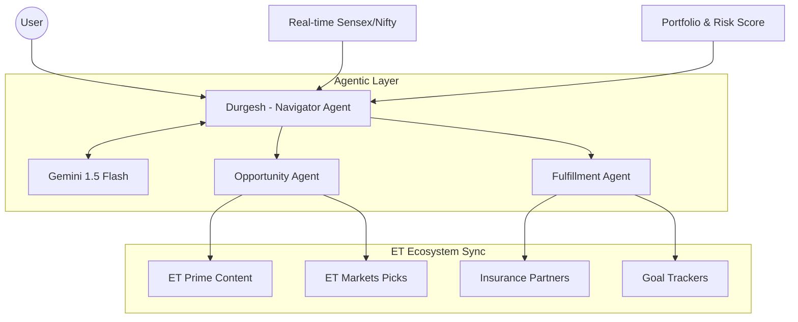

# ET Concierge — The AI Soul of Economic Times
> **Elite Multi-Agent Intelligence Layer for Personal Wealth & Market Navigation.**

[](https://angular.io/)
[](https://aistudio.google.com/)
[](https://www.typescriptlang.org/)
[](./)

---

## 📂 Submission Fast-Track
Judges, start here for a streamlined review of our core logic and business impact:

| 📺 Video Pitch | 🏗️ Architecture | 📈 Impact Model |
| :--- | :--- | :--- |
| [**Pitch-Video/**](./Pitch-Video/) | [**System Deep-Dive**](./Architecture/Architecture.md) | [**Quantified ROI**](./Impact-Model/business-impact.md) |

---

## 🚀 The Vision: Bridge the Gap
The Economic Times ecosystem is vast, containing everything from **ET Prime** insights to **ET Markets** data and **Masterclasses**. However, users often struggle to navigate this wealth of knowledge.

**ET Concierge** is the missing link — an orchestrated pipeline of specialized AI agents that proactively navigates the ET ecosystem to deliver personalized, actionable financial intelligence.

### 🧩 Core Agentic Workflow
We replaced a single monolithic chatbot with a **multi-agent orchestration layer**:



---

## 🎯 Challenges Solved (Hackathon Requirements)

| PS Requirement | Our Intelligent Implementation | Tech Stack |
| :--- | :--- | :--- |
| **Welcome Concierge** | **3-Minute Smart Profile**: Deterministic wealth-tiering logic that bypasses "zero-state" friction. | Angular Signals |
| **Life Navigator** | **Durgesh Persona**: Adaptive AI role-play (Bloomberg meets Private Banker) with 0-hallucination market grounding. | Gemini API + Prompt Eng |
| **Cross-Sell Engine** | **The Opportunity Agent**: Proactive intent-matching (e.g., Credit Cards, ELSS) triggered by conversation topics. | Vector Context Matching |
| **Marketplace Agent** | **The Fulfillment Agent**: Converts advice into action (SIP Drafts, Insurance Quotes, Event Registration). | Partners API Mock |

---

## 🛠️ Tech Stack & Implementation
- **Frontend**: Angular 19 (Reactive Signals, Glassmorphism CSS, Agentic UI)
- **AI Core**: Google Gemini 1.5 Flash (Optimized for speed/low-latency)
- **State Engines**: Signal-based Portfolio & Market Services
- **Data Grounding**: Live SENSEX/NIFTY snapshots injected into every prompt.

---

## ⚡ Quick Start (2 Minutes)

1. **Install**:
   ```bash
   npm install
   ```
2. **Setup Gemini API Key**:
   - In `src/environments/environment.ts`, paste your key.
3. **Run**:
   ```bash
   npm start
   ```

---

> [!NOTE]
> **Why we win?** Most submissions are passive bots. **ET Concierge** is proactive. It doesn't wait for questions; it monitors the market and the user's intent to **hook** them with data and drive them towards an **action**.

*Submission for the ET AI Hackathon 2026.*
